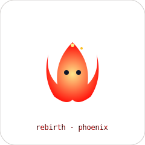

<div align="center">

# ∞ readme.lab

### Craft a GitHub profile that *breathes* — not one that bores.

**1100+ real, working assets** · animated SVG banners · live-editable pets · playable games · badges · stat cards · README templates
Every item previews live, edits inline, renames, copies & drops straight into your `README.md`.

[](https://readme-lab.pages.dev/)
[](https://github.com/SudhirDevOps1/readme.lab)


</div>

---

## ✨ What's inside

| Section | Count | What each item is |
|---------|-------|-------------------|
| ◼ **SVG Banners** | 136 | Real animated SVG (SMIL) · fills your name/role/handle live · copy + download |
| § **READMEs** | 24 | Full markdown templates · live preview / edit / source view |
| ✂ **Snippets** | 469 | Real shields.io / skillicons / capsule-render markdown, each copyable |
| 🐾 **Pets** | 66 | Animated SVGs · live color / speed / size editing + rename |
| ▶ **Games** | 24 | Fully playable React mini-games |
| ▦ **Stats** | 80 | Real themes with live GitHub image previews |
| ▤ **Stat Cards** | 400 | 80 themes × 5 card types · each copyable with thumbnail |
| ◉ **Badges** | 45 | Live shields.io badge maker with color swatches |

> Every number above is computed at runtime from real data — **zero fakes**.

---

## 🚀 Quick start

```bash
# clone
git clone https://github.com/SudhirDevOps1/readme.lab.git
cd readme.lab

# install
npm install

# dev
npm run dev

# build for production
npm run build
```

The production build outputs a single self-contained `dist/index.html` you can host anywhere.

- **Live:** https://readme-lab.pages.dev/
- **Repository:** https://github.com/SudhirDevOps1/readme.lab

### Deploy to Cloudflare Pages

Connect `SudhirDevOps1/readme.lab` in Cloudflare Pages and use:

| Setting | Value |
|---------|-------|
| Framework preset | Vite |
| Build command | `npm run build` |
| Output directory | `dist` |
| Node version | `22` |

Every push to the default branch will update `https://readme-lab.pages.dev/` automatically.

---

## 🧭 How to use it

1. **Set your identity** — type your name, role & GitHub handle at the top. Everything updates live.
2. **Browse a tab** — banners, pets, snippets, games, stat cards, badges, READMEs.
3. **Customize** — pets have color/speed/size sliders, templates have a live markdown editor with
   syntax highlighting, everything is renamable.
4. **Copy or download** — one click copies markdown, or downloads an `.svg` / `.md` file.
5. **Paste into your profile README** — create a repo named exactly like your username
   (`SudhirDevOps1/SudhirDevOps1`) so its README shows on your GitHub profile.

### Embedding an SVG

```markdown
<!-- relative path (file uploaded to the repo) -->


<!-- raw URL -->

```

---

## 🗂 Project structure — where to edit & add content

```
src/
├─ App.tsx                 # main app shell, tabs, identity inputs
├─ components/
│  ├─ CodeBlock.tsx        # syntax-highlighted code viewer (copy/download)
│  └─ SiteFooter.tsx       # animated footer
├─ lib/
│  └─ highlight.ts         # markdown + xml/svg syntax highlighter
├─ data/
│  ├─ banners.ts           # ← add SVG banner templates here
│  ├─ pets.ts              # ← add animated pets here
│  ├─ templates.ts         # ← add README templates here
│  └─ snippets.ts          # ← add markdown snippets here
├─ games.tsx               # ← add playable games here (React components)
└─ index.css               # fonts, theme tokens, animations
```

### Add a new pet

```ts
// src/data/pets.ts  →  add to premiumPets[]
{
  id: 'myPet', name: 'Cutie', emoji: '🐾', vibe: 'happy · bouncy',
  svg: ({ color = '#f59e0b', speed = 2, scale = 1 } = {}) => petFrame(`
    <g transform="translate(${'${w/2*scale}'} ${'${h/2*scale}'}) scale(${'${scale}'})">
      <!-- your SVG shapes here, use ${'${color}'} and ${'${speed}'} -->
    </g>`, '#0f172a'),
}
```

### Add a new snippet

```ts
// src/data/snippets.ts
s('widget', 'My Badge', ''),
```

### Add a new README template

```ts
// src/data/templates.ts  →  push into TEMPLATES[]
{
  id: 'my-template', name: 'My Template', persona: 'developer',
  emoji: '🚀', accent: 'violet',
  md: `# Hi, I'm {{NAME}}\n\n{{ROLE}} · @{{HANDLE}}`,
}
```

### Add a new game

```tsx
// src/games.tsx  →  export a component, then add to GAMES_META[]
export function MyGame() { /* React state + JSX */ }
// ...
{ id: 'mygame', name: 'My Game', emoji: '🎮', cmp: MyGame },
```

---

## 🎨 Features

- **Live editing** everywhere — sliders, color pickers, inline markdown editor
- **Automatic local save** — identity, stats and badge settings persist between visits
- **Config import/export** — move a complete setup between browsers as JSON
- **Syntax highlighting** for Markdown & SVG/XML (custom, zero-dependency)
- **Three view modes** for templates: preview · edit · source
- **Rename** files before download
- **Search & filter** in every large tab
- **Fully responsive** — mobile, tablet, desktop
- **Animated footer** with waves + floating particles
- **GitHub API loader** — pull any user's name/bio/handle instantly
- **Production links** — live app and repository are available in the header and animated footer

---

## 📦 Tech

- **React 19** + **Vite 7** + **Tailwind CSS 4**
- Single-file production bundle via `vite-plugin-singlefile`
- Fraunces (display) · Space Grotesk (body) · JetBrains Mono (code)

---
<div align="center">
  
  <br>
  Made with ❤ by [SudhirDevOps1](https://github.com/SudhirDevOps1) · MIT License · 2026
  <br>
  
</div>
